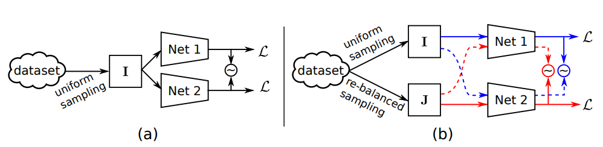
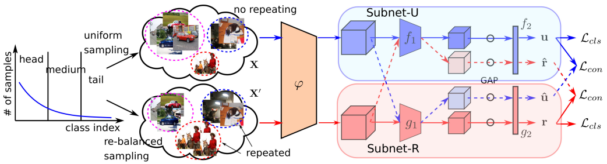

# Long-Tailed Multi-Label Visual Recognition by Collaborative Training on Uniform and Re-balanced Samplings

This readme file is an outcome of the [CENG502 (Spring 2022)](https://ceng.metu.edu.tr/~skalkan/ADL/) project for reproducing a paper without an implementation. See [CENG502 (Spring 2022) Project List]([https://github.com/sinankalkan/CENG502-Spring2021](https://github.com/CENG502-Projects/CENG502-Spring2022)) for a complete list of all paper reproduction projects.

# 1. Introduction

The paper : [Long-Tailed Multi-Label Visual Recognition by Collaborative Training on Uniform and Re-balanced Samplings ]([https://openaccess.thecvf.com/content/CVPR2021/html/Guo_Long-Tailed_Multi-Label_Visual_Recognition_by_Collaborative_Training_on_Uniform_and_CVPR_2021_paper.html](https://openaccess.thecvf.com/content/CVPR2021/html/Guo_Long-Tailed_Multi-Label_Visual_Recognition_by_Collaborative_Training_on_Uniform_and_CVPR_2021_paper.html))

The paper is published in CVPR2021 and achieves state of the art results. On top of achieving state of the art results they actually develop a novel method. Our goal is to reproduce authors' results in the same way they did. They simply and judiciously add one of their novelties at a time and show its indiviual contribution. So our goal is to reproduce the table in img4 by adding one method at a time. Even if we can't get numerically close results to the paper's we would like to similar effects of each proposed method's addition. 

## 1.1. Paper summary

Re-sampling is highly utilized to improve long tailed datasets. Mutual learning [1] and co-regularization [2] with two subnets as in Figure 1 (a) were used to improve performance. 

  

  Figure 1

This paper adopts this network structure but feeds it with two different sampling methods of the same dataset as in Figure 2. Subnet-U is fed with uniform sampling where each individual sample has equal probility and Subnet-R is fed with re-balanced sampling so that each class has equal probability. Petrained Resnet50's last stage is used as the Subnet and the bottom part is used as Φ(phi) network.\
Re-balanced sampling can improve performance of tail classes but hurts the performance of head classes. So we can say that for this network structure Subnet-U accounts for head classes and Subnet-R accounts for tail classes. 

  

  Figure 2

The loss equation is given in equation 1. First and second terms at the right hand side of the equation are for Subnet-U and Subnet-R's classification outputs. The classification loss (Lcls) is simply a binary cross-entropy based classification loss. The losses in the hyper parameter λ(lambda) is are consistency losses. These losses are calculated using the dashed lines in Figure 2. The consistency losses on the cross-branches enforce the the subnets' outputs to be similar. 

Using the different samplings and the developing a two-branch network together with a cross-branch loss to enforce consistenc is this paper's contribution. The paper's most important claim is to improve tail classes' performance without hurting head classes' performance. As can be seen in below 

Lastly they introduce the logit compensation term for the classificaiton loss in 

@TODO: Summarize the paper, the method & its contributions in relation with the existing literature.

# 2. The method and my interpretation

## 2.1. The original method

@TODO: Explain the original method.
- Creating long tailed dataset from Pascal Voc and Ms Coco
## 2.2. Our interpretation 

@TODO: Explain the parts that were not clearly explained in the original paper and how you interpreted them.
- Creating Long tailed dataset part is only explained with a sentence Pareto distribution used, we follow the references but could not found the exact way so we use the 6-6-8 split which explained in papers with 4-20 , 20-100 and 100-775 image sample intervals. 
- 

# 3. Experiments and results

## 3.1. Experimental setup

@TODO: Describe the setup of the original paper and whether you changed any settings.\
Original paper used Pytorch 1.4.0 version but we used 1.12.0 .\
We tried to follow the same procedure while preparing Long Tailed dataset but our set is different inevitably.

## 3.2. Running the code

You can find our version of Long tailed Voc Dataset with these links. \
[Pascal VOC]([http://host.robots.ox.ac.uk/pascal/VOC/](http://host.robots.ox.ac.uk/pascal/VOC/)) \
[dataset_voc_test.zip]([https://drive.google.com/file/d/14zlzl8V-gI7f9hAlLgcZgoYSK9TJdBD7/view?usp=sharing](https://drive.google.com/file/d/14zlzl8V-gI7f9hAlLgcZgoYSK9TJdBD7/view?usp=sharing)) \
[dataset_voc_lt.zip]([https://drive.google.com/file/d/135dGh0ti0vvIbWeePVN66UQvkX8DKJAr/view?usp=sharing](https://drive.google.com/file/d/135dGh0ti0vvIbWeePVN66UQvkX8DKJAr/view?usp=sharing)) 

We used docker container with Pytorch 1.12.0 , Python 3.7.13 on Ubuntu 18.04 Desktop Pc. You can pull the latest docker image with these commands. \
`docker pull pytorch/pytorch:latest`  
`docker run --gpus all -v /guo2021:/guo2021 -w /guo2021 -it pytorch/pytorch:latest`

You can directly use our dataset.zip files by extracting them to dataset_voc_lt and dataset_voc_test or you can create your own version with \
`python src/createLongTailedDataset.py` \
`python src/createTestDataset.py`\
All the parameters can be found in configuration.py file. After setting paremeters properly you can directly run train.py file to start training. \
`python src/train.py` This code will store weight files in src/weight folder, you can use them later for testing. \
`python src/test.py` This code will run the test set.

├── dataset_org\
│   ├── VOCtest_06-Nov-2007.tar\
│   ├── VOCtest_06-Nov-2007\
│   └── VOCtrainval_11-May-2012.tar\
│   ├── VOCtrainval_11-May-2012\
├── dataset_voc_lt\
│   ├── dataset_voc_lt.zip\
│   ├── images\
│   └── labels\
│   ├── info.txt\
├── dataset_voc_test\
│   ├── dataset_voc_test.zip\
│   ├── images\
│   └── labels\
│   ├── info.txt\
├── src\
│   ├── ClassAwareSampler.py\
│   ├── configuration.py\
│   ├── createLongTailedDataset.py\
│   ├── createTestDataset.py\
│   ├── mean_ap.py\
│   ├── Network.py\
│   ├── test.py\
│   ├── train.py\
│   ├── VocDataset.py\
│   └── weights\
├── runs\
│   ├── 1656888576_only_uniform\
│   ├── 1656888901_only_rebalanced\
│   ├── 1656889605\
│   └── 1656889821\
├── dockerCommands.txt\
├── README.md\

## 3.3. Results

@TODO: Present your results and compare them to the original paper. Please number your figures & tables as if this is a paper.

# 4. Conclusion

@TODO: Discuss the paper in relation to the results in the paper and your results.

# 5. References
- Network.py - https://deci.ai/blog/measure-inference-time-deep-neural-networks/
- ClassAwareSampler.py - https://github.com/open-mmlab/mmdetection 
- VocDataset.py - https://github.com/andrewssobral/deep-learning-pytorch/blob/master/segmentation/utils/dataset.py
- train.py - https://discuss.pytorch.org/t/is-there-any-nice-pre-defined-function-to-calculate-precision-recall-and-f1-score-for-multi-class-multilabel-classification/103353

- [1] (27th reference in the paper) Xuesong Niu, Hu Han, Shiguang Shan, and Xilin Chen. Multi-label co-regularization for semi-supervised facial action unit recognition. In Advances in Neural Information Processing Systems, pages 909–919, 2019. 1, 2, 3, 4, 7
- [2] (51th reference in the paper) Ying Zhang, Tao Xiang, Timothy M Hospedales, and Huchuan Lu. Deep mutual learning. In IEEE Conference on Computer Vision and Pattern Recognition, pages 4320– 4328, 2018. 1, 2, 3, 4, 7

# Contact

- Baran Gülmez \
baran.gulmez07@gmail.com
- Ibrahim Koc \
iibrahimkoc@gmail.com
